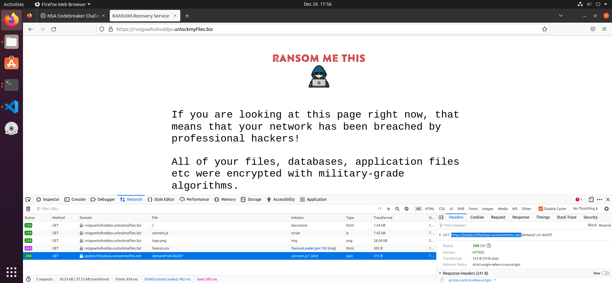

# **Task B1 - Information Gathering**

## <ins>Topics:</ins>

Reverse Engineering, Web Analysis

## <ins>Task Description<ins>

The attacker left a file with a ransom demand, which points to a site where they're demanding payment to release the victim's files.

We suspect that the attacker may not have been acting entirely on their own. There may be a connection between the attacker and a larger ransomware-as-a-service ring.

Analyze the demand site, and see if you can find a connection to another ransomware-related site.

## <ins>Provided Files<ins>

<ul>
<li>Demand note from the attacker (YOUR_FILES_ARE_SAFE.txt)</li>
</ul>

## <ins>Solution<ins>

### **1) Investigating the ransom website**

Looking at the provided text file shows that the victim is expected to go to https://rvizguwhsihoddyv.unlockmyfiles.biz/ to learn how to recover their files. Using developer tools, we can see in the Network tab that when this page loads, it makes calls to another website to get the ransom amount and due date.

This then gives us the answer for this task:

padytccfzhyzlaza.ransommethis.net