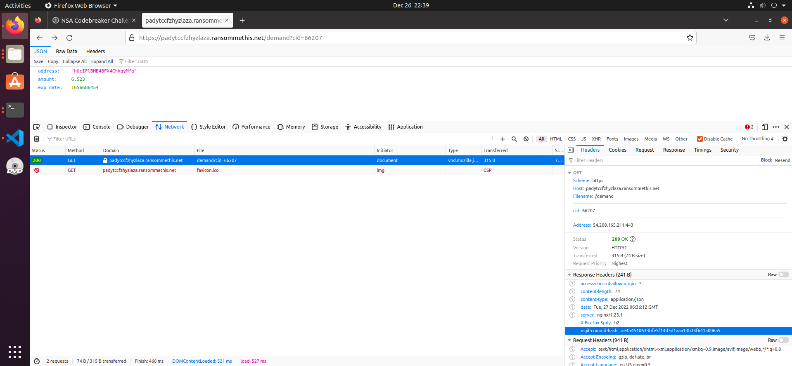

# **Task B2 - Getting Deeper**

## <ins>Topics:</ins>

Web Hacking, [redacted]

## <ins>Task Description<ins>

It looks like the backend site you discovered has some security features to prevent you from snooping. They must have hidden the login page away somewhere hard to guess.

Analyze the backend site, and find the URL to the login page.

Hint: this group seems a bit sloppy. They might be exposing more than they intend to.

**Warning:** Forced-browsing tools, such as DirBuster, are unlikely to be very helpful for this challenge, and may get your IP address automatically blocked by AWS as a DDoS-prevention measure. Codebreaker has no control over this blocking, so we suggest not attempting to use these techniques.

## <ins>Provided Files<ins>

None

## <ins>Solution<ins>

### **1) Investigating the backend site**

Going to the endpoint for the ransom api at https://padytccfzhyzlaza.ransommethis.net/demand?cid=66207 and checking the Network tab in Developer tools shows us an interesting header called `x-git-commit-hash`in the response headers.

Using this as a hint, trying the URL https://padytccfzhyzlaza.ransommethis.net/.git gives a `Directory Listing Disabled` error instead of the `Unauthorized` error seen when trying other URLs. This hints that the `.git` folder is available to anyone, and this is confirmed by going to https://padytccfzhyzlaza.ransommethis.net/.git/index which installs a git index file.

### **2) Extracting source code from .git**

The structure of `.git` folders and the files within is [well documented](https://humbletoolsmith.com/2022/01/30/a-look-inside-the-_git-folder/). Searching for tools online shows one called [gin](https://github.com/sbp/gin) which parses information from index files. Using the command `gin -j index > objects.json` gives a json file containing info from the git index.

File contents in a git repository are stored in a compressed format inside of `.git/objects` split among subfolders with two hex character folders that contain the compressed files inside them. The names of these files and the folder names are derived from SHA-1 of a header and file contents. The contents of the compressed files can be [recovered](https://matthew-brett.github.io/curious-git/reading_git_objects.html) and this gives source code.

We can make a script which goes over all files recorded in the `index` file and downloads/uncompresses them (`download_git.py`). This gets us the source code for the entire backend site. Now looking through the source code we see in `server.py` that the endpoint for the login page is the following:

https://padytccfzhyzlaza.ransommethis.net/nukoscislzmqpewx/login